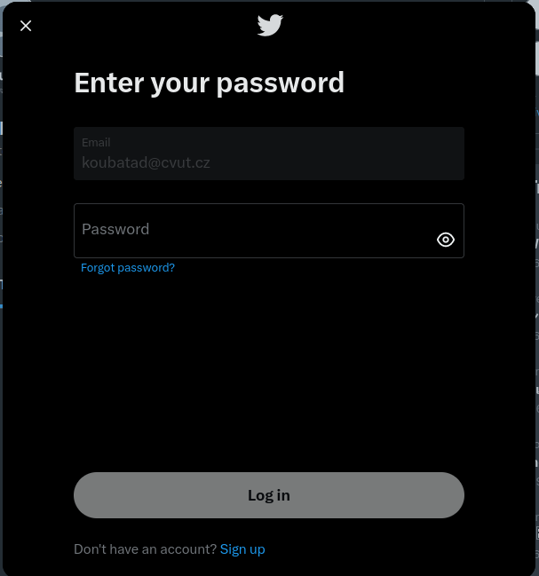
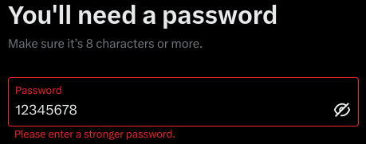
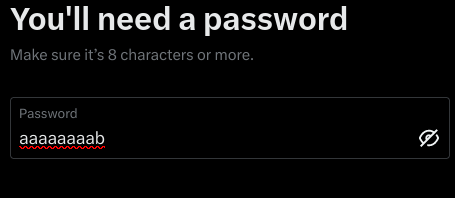
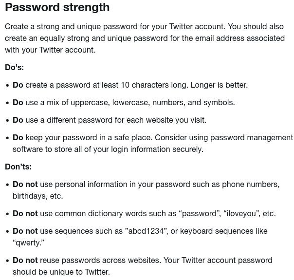
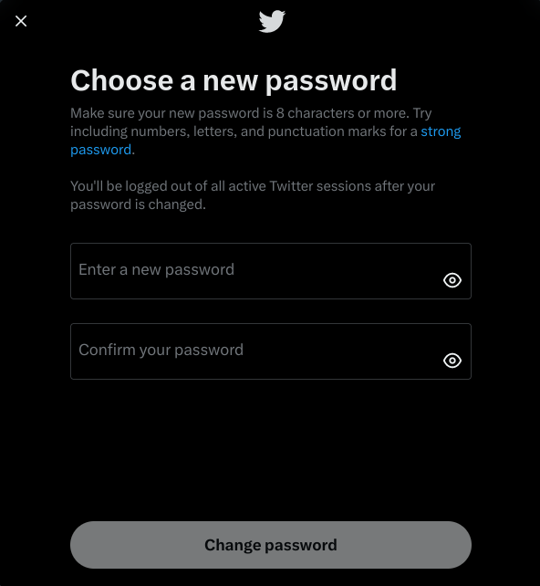

<h1 style="text-align: center; font-size: 350%"> Twitter Penetration Test Report</h1>   
<h2 style="text-align: center">BI-EHA Semestral work</h2>


---

<br><br><br><br><br><br><br><br><br><br><br><br><br><br><br><br><br><br><br><br><br><br><br>
<br><br><br><br><br><br>

<h3 style="text-align: center;">Jan Koníř, Tadeáš Kouba</h3>
<h3 style="text-align: center;">FIT CTU, 2023</h3>

<!-- Page break -->
<div style="page-break-after: always;"></div>

<!-- ======================================================================================================================================================== -->
# Table of Contents

- [Table of Contents](#table-of-contents)
- [Introduction](#introduction)
  - [Team Info](#team-info)
  - [Project Overview](#project-overview)
  - [Scope Description](#scope-description)
  - [Pentesting Methodology](#pentesting-methodology)
  - [Scoring System](#scoring-system)
- [Executive Summary](#executive-summary)
- [List of Findings](#list-of-findings)
- [Pre-engagement](#pre-engagement)
  - [Threat Model](#threat-model)
  - [Intelligence-gathering Outcomes](#intelligence-gathering-outcomes)
- [Testing process](#testing-process)
  - [4.1 Information Gathering](#41-information-gathering)
  - [4.2 Configuration and Deployment Management Testing](#42-configuration-and-deployment-management-testing)
  - [4.3 Identity Management Testing](#43-identity-management-testing)
  - [4.4 Authentication Testing](#44-authentication-testing)
    - [4.4.1 Testing for Credentials Transported over an Encrypted Channel](#441-testing-for-credentials-transported-over-an-encrypted-channel)
    - [4.4.2 Testing for Default Credentials](#442-testing-for-default-credentials)
    - [4.4.3 Testing for Weak Lock Out Mechanism](#443-testing-for-weak-lock-out-mechanism)
    - [4.4.4 Testing for Bypassing Authentication Schema](#444-testing-for-bypassing-authentication-schema)
    - [4.4.5 Testing for Vulnerable Remember Password](#445-testing-for-vulnerable-remember-password)
    - [4.4.6 Testing for Browser Cache Weaknesses](#446-testing-for-browser-cache-weaknesses)
    - [4.4.7 Testing for Weak Password Policy](#447-testing-for-weak-password-policy)
    - [4.4.8 Testing for Weak Security Question Answer](#448-testing-for-weak-security-question-answer)
    - [4.4.9 Testing for Weak Password Change or Reset Functionalities](#449-testing-for-weak-password-change-or-reset-functionalities)
    - [4.4.10 Testing for Weaker Authentication in Alternative Channel](#4410-testing-for-weaker-authentication-in-alternative-channel)
  - [4.5 Authorization Testing](#45-authorization-testing)
  - [4.6 Session Management Testing](#46-session-management-testing)
  - [4.7 Input Validation Testing](#47-input-validation-testing)
  - [4.8 Testing for Error Handling](#48-testing-for-error-handling)
  - [4.9 Testing for Weak Cryptography](#49-testing-for-weak-cryptography)
  - [4.10 Business Logic Testing](#410-business-logic-testing)
  - [4.11 Client-side Testing](#411-client-side-testing)
- [Sources](#sources)


<!-- Page break -->
<div style="page-break-after: always;"></div>
<!-- ======================================================================================================================================================== -->

# Introduction
## Team Info

- Jan Koníř
  - konirjan@fit.cvut.cz
  - Student of CTU, Faculty of Information Technology

<br>

- Tadeáš Kouba
  - koubatad@fit.cvut.cz
  - Student of CTU, Faculty of Information Technology

<!-- Page break -->
<!-- <div style="page-break-after: always;"></div> -->
<!-- ======================================================================================================================================================== -->

## Project Overview
This report is part of semestral work for subject Ethical hacking of the Information Security program on FIT, CTU.  
The focus is to assert skills gained during the semester as well as use them in real-world scenario. The website [twitter.com](https://twitter.com/) has been chosen for this purpouse as it offers a [bug bounty](https://hackerone.com/twitter?type=team) and is therefore eligible for ethical hackers to try and hack.  

<!-- Page break -->
<!-- <div style="page-break-after: always;"></div> -->
<!-- ======================================================================================================================================================== -->

## Scope Description
We will be focusing on the web application on domain twitter.com.  
While the bug bounty posted by twitter puts some vulnerabilities out scope for financial reward, we will still be trying to perform these attacks as to deepen our ethical hacking skills.

<!-- Page break -->
<!-- <div style="page-break-after: always;"></div> -->
<!-- ======================================================================================================================================================== -->

## Pentesting Methodology
<!-- https://owasp.org/www-project-web-security-testing-guide/stable/ -->
As a pentesting methodology we have chosen the [OWASP Web Application Security Testing](https://owasp.org/www-project-web-security-testing-guide/v42/4-Web_Application_Security_Testing/) guide - version 4.2, which is the latest stable version. To be more precise, we will be covering following topics:
  - Configuration and Deployment Management Testing
  - Identity Management Testing
  - Authentication Testing
  - Authorization Testing
  - Session Management Testing
  - Input Validation Testing
  - Testing for Error Handling
  - Testing for Weak Cryptography
  - Business Logic Testing
  - Client-side Testing

<!-- Page break -->
<div style="page-break-after: always;"></div>
<!-- ======================================================================================================================================================== -->

## Scoring System
We will be using the widely used [Common Vulnerability Scoring System (CVSS)](https://www.first.org/cvss/specification-document) standard for evaulating the threat levels of vulnerabilities found in this report. In particular we will use the CVSS 3.1 version. The standard defines multiple metrics (base, temporal, environmental), however we will use only the base metric since we are performing a one-time pentesting as external entity so the temporal and environmental metrics are not that important and available to us.  
We will be scoring each vulnerability on several factors such as access complexity, confidentiality impact, integrity impact and others, to calculate the final score. This will determine the final rating of that vulnerability as seen in the following table.  

<!-- CSS for scoring table-->
<style>
.scoring_table {
  width: 100%;
  border: 2px solid;
  border-collapse: collapse;
}

tr:nth-child(even) {
  background-color: #f2f2f2;
}

th {
  border-bottom: 2px solid;
  text-align: center;
}

td {
  border: 1px solid;
  text-align: center;
}
</style>

<!-- Scoring Table -->
<table class="scoring_table">
  <tr>
    <th>Rating</th>
    <th>CVSS Score</th>
  </tr>
  <tr>
    <td>Low</td>
    <td>0.1 - 3.9</td>
  </tr>
  <tr>
    <td>Medium</td>
    <td>4.0 - 6.9</td>
  </tr>
  <tr>
    <td>High</td>
    <td>7.0 - 8.9</td>
  </tr>
  <tr>
    <td>Critical</td>
    <td>9.0 - 10.0</td>
  </tr>
</table>

<!-- Page break -->
<div style="page-break-after: always;"></div>
<!-- ======================================================================================================================================================== -->

# Executive Summary
TBD

<!-- Page break -->
<div style="page-break-after: always;"></div>
<!-- ======================================================================================================================================================== -->

# List of Findings
TBD

<!-- Page break -->
<div style="page-break-after: always;"></div>
<!-- ======================================================================================================================================================== -->

# Pre-engagement
## Threat Model
Twitter does not openly disclose how its backend communication works.  
Since twitter is a web application it is obviously exposed to the internet which naturally puts it in proximity of multitude of threats. On top of that it is definitely an attractive target for hackers, since it stores personal information of about 350 million people.  
Some vulnerable points might be the client-server-database communication for authentication or tweets being stored in database and showing to completely random users' feeds.

<!-- Page break -->
<!-- <div style="page-break-after: always;"></div> -->
<!-- ======================================================================================================================================================== -->

## Intelligence-gathering Outcomes
Firstly we ran port scan with **nmap**. We used the following command to find the open ports and possibly the version of service running on them:  
```nmap -sV twitter.com```  
  

Full output can be seen in *outputs/nmap_version.txt*.     
We can see that there are two open tcp ports (80, 443).

We then ran **nmap** with intention to determine the OS running, version and traceroute with:  
```nmap -A twitter.com```  
  

  
Full output can be seen in *outputs/nmap_A.txt*.   
Here it is specified that on port 80 there is http running. Also all requests sent are returned with HTTP 400 so service as well as OS could not be recognized.

Then we ran **dnsenum** to try and gather some infromation about the domain:  
```dnsenum --enum twitter.com```  
  
Full output can be seen in *outputs/dnsenum.txt*.     
Which listed us a lot of subdomains and IP addresses of twitter.


As stated before the twitter developers don't share much information about twitter.
However through developer [blog](https://blog.twitter.com/engineering/en_us/topics/) they sometimes discuss what actually happens on twitter's backend. Through that we were able to find out that twitter used to run on MySQL database, but has switched to distributed database NoSQL system called Manhattan, that is custom developed for twitter. Manhattan itself utilizes multiple open-source technologies like Apache Cassandra or Hadoop. This information might prove useful for performing some SQL Injection attacks. 

As for the front-end part of Twitter it mostly consists of HTML, CSS and Javascript, particularly React.js. Of those, React.js is obviously the one to be concentrated on when pentesting. Some of its most common vulnerabilities are Cross-site scripting, SQL injection, Cross-site request forgery, Vulnerability in packages and dependencies, Broken authentication, Zip slip or XML external entities.

Last but not least we tried so called Google Hacking/Dorking but it didn't disclose any important information.

<!-- Page break -->
<div style="page-break-after: always;"></div>
<!-- ======================================================================================================================================================== -->

# Testing process

## 4.1 Information Gathering

This topic is covered in the [Pre-engagement section](#pre-engagement).

<!-- Page break -->
<div style="page-break-after: always;"></div>
<!-- ======================================================================================================================================================== -->

## 4.2 Configuration and Deployment Management Testing

<!-- Page break -->
<div style="page-break-after: always;"></div>
<!-- ======================================================================================================================================================== -->

## 4.3 Identity Management Testing

<!-- Page break -->
<div style="page-break-after: always;"></div>
<!-- ======================================================================================================================================================== -->

## 4.4 Authentication Testing
### 4.4.1 Testing for Credentials Transported over an Encrypted Channel  
Twitter uses TLSv1.2 for data transfer encryption and HTTPS for all communication including login, user creation and password change, it can not be forced to 
use unsecure HTTP.  
  
Communication capture of login via Wireshark.  

### 4.4.2 Testing for Default Credentials  
While testing different credentials in the register page I found out there are users with admin@twitter.com and guest@twitter.com registered.  
  
  
Twittter indeed uses @twitter.com address (for example registering verification mail is sent from verification@email.com) and they [state](https://help.twitter.com/en/safety-and-security/fake-twitter-emails)
it as official way of communication,  
  
however there is no way of knowing if they are actual twitter.com default/admin credentials, they can however be used to lock out these accounts as described below.  

### 4.4.3 Testing for Weak Lock Out Mechanism  
Twitter's lock out mechanism activates after 5-15 (scales with repeating tries) unsuccessful entries of password/username any following tries result in the following message.  
  
Unlock mechanism is time-based with time-out of 30+ minutes (Twitter [officially states](https://help.twitter.com/en/managing-your-account/locked-out-after-too-many-login-attempts)
it is an hour lock-out, my first lock-out was shorter though).
  
It also provides possibility to send a form with login issue, but non of the possibilities fits nor helps with the lock out issue.  
  
If twitter suspects an unusual login activity (lot of bad tries/new location) it prompts the user to input their username or phone, this can also be used to lock-out an account,
as it uses same policy as password lock-out mechanism.  
  

### 4.4.4 Testing for Bypassing Authentication Schema  
It is not possible to bypass authentication through direct page request. It is possible to visit someones profile with `twitter.com/<username>`, however this does not
disclose any personal/secret information as it shows someones profile (what it shows depends on individual's account security settings).  
Session IDs look random, they have some simmilar parts but their value changes unpredictably each login even in concurrent sessions.  

### 4.4.5 Testing for Vulnerable Remember Password  
The login page does not offer 'remember password' functionality and it does not store user's credentials instead replacing them with secure tokens like sessionID.  
  

### 4.4.6 Testing for Browser Cache Weaknesses  
Attacker can not access private information with the 'History' function and 'Back' button, he gets redirected to secure version of that page where he acts as a guest account or to login page to get authorized.  
The website uses HTTP directives to secure cache correctly with the following settings (copied from request headers).  
  
Twitter stores a lot of information in cache, it does so securely and no information can be gathered from the cache. The cache can be viewed by using URL `about:cache` on Firefox.    
  

### 4.4.7 Testing for Weak Password Policy
Password policy allows any type of character found on standart keyboard. It requires at least 8 characters and accepts 128 at most. It does not force numbers or special characters
but a shord password without those will be marked as weak and not accepted. The passwords are checked against common passwords so passwords like `princess` or `password` or `iloveyou` 
will not be allowed, however adding a number to them will 'fix' this so password like `princess1` or `password1234` work. General password entropy is not calculated as passwords like `aaaaaaaab`
are also accepted. During registration user can choose password same as his chosen username but if he tries to change a password to his username later via the 'Change you password' function as loged user
password with his username will be rejected (part of it with numbers is okay though). It is not required to confirm password which made me accidetaly enter and submit password I was not yet intending to
use and therefore did not know it when trying to log in again forcing me to reset password.  

User is not forced to change his password after any period of time and he can change his password whenever he pleases with different methods. Change password function requires previous password knowledge. 
The changed passwords can be very simmilar to previous, it is not allowed to change to same password though. Also the warning messages are different from those seen during registration, if we use common 
password (princess/password) we are presented with *`That password is too easy to guess. Please choose a stronger password.`* while in registration the message was just *`Please enter a stronger password`*. 
Registration phase allows *`show password`* function while *`change password`* function does not.  

  
  
  
  
  
  

As mentioned before twitter does not force pretty much any requrements from the password although they provide tips for password strenght in their [Help center](https://help.twitter.com/en/safety-and-security/account-security-tips)
  

### 4.4.8 Testing for Weak Security Question Answer  
Twitter does not use security question functionality.  

### 4.4.9 Testing for Weak Password Change or Reset Functionalities  
Logged in users can change their passwords with method described under [Testing for Weak Password Policy](#447-testing-for-weak-password-policy) using their current password.  
If user is not logged in he can reset his password via the *`Forgot password?`* functionality. If unusual activity is detected user is prompted to input their username (As described in above subsections), meaning password of
disclosed users (for example previously found admin@twitter.com) cannot be reset. Otherwise user is asked to select email to send verification code to (the code seems to be 8 lenght randomly generated digit-letter sequence).
After inputing the correct code user can change his password. The password policy to new password as well as warning messages are the same as when registrating with new password, this time however it is reqiuired to repeat the password.
When the password is reset user is prompted to enter reason for changing password and is logged out of all active Twitter sessions, as stated in Twitter's [Help Center](https://help.twitter.com/en/managing-your-account/forgotten-or-lost-password-reset).  
  

### 4.4.10 Testing for Weaker Authentication in Alternative Channel  
No alternative channels are in our scope (mobile/desktop app).  

<!-- Page break -->
<div style="page-break-after: always;"></div>
<!-- ======================================================================================================================================================== -->

## 4.5 Authorization Testing

<!-- Page break -->
<div style="page-break-after: always;"></div>
<!-- ======================================================================================================================================================== -->

## 4.6 Session Management Testing

<!-- Page break -->
<div style="page-break-after: always;"></div>
<!-- ======================================================================================================================================================== -->

## 4.7 Input Validation Testing

<!-- Page break -->
<div style="page-break-after: always;"></div>
<!-- ======================================================================================================================================================== -->

## 4.8 Testing for Error Handling

<!-- Page break -->
<div style="page-break-after: always;"></div>
<!-- ======================================================================================================================================================== -->

## 4.9 Testing for Weak Cryptography

<!-- Page break -->
<div style="page-break-after: always;"></div>
<!-- ======================================================================================================================================================== -->

## 4.10 Business Logic Testing

<!-- Page break -->
<div style="page-break-after: always;"></div>
<!-- ======================================================================================================================================================== -->

## 4.11 Client-side Testing

<!-- Page break -->
<div style="page-break-after: always;"></div>
<!-- ======================================================================================================================================================== -->


# Sources

- https://blog.twitter.com/engineering/en_us/topics/infrastructure/2017/the-infrastructure-behind-twitter-scale

- https://www.first.org/cvss

- https://blog.twitter.com/engineering/en_us/topics/

- http://www.pentest-standard.org

- https://www.thirdrocktechkno.com/blog/react-security-vulnerabilities/
